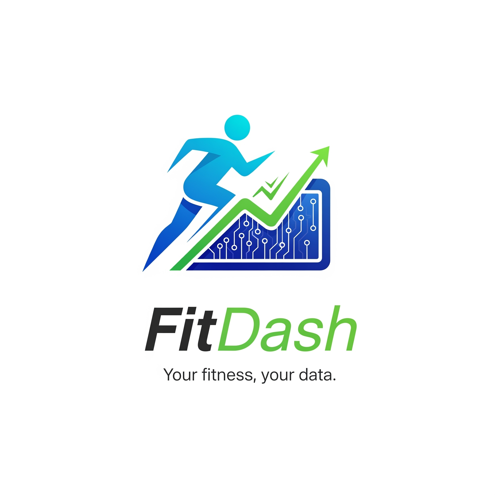

<div align="center">

# 🏋️‍♀️ FitDash - Your Fitness Companion



[](https://reactjs.org/)
[](https://www.typescriptlang.org/)
[](https://vitejs.dev/)
[](https://tailwindcss.com/)
[](https://reactrouter.com/)
[](https://tanstack.com/query)

[](https://recharts.org/)
[](https://react-hook-form.com/)
[](https://zod.dev/)
[](https://lucide.dev/)
[](https://ui.shadcn.com/)
[](https://eslint.org/)

</div>

FitDash is a comprehensive fitness tracking platform built with modern web technologies to help you achieve your health and wellness goals. Whether you're just starting out or a seasoned athlete, FitDash provides intuitive tools to track progress, plan workouts, and stay motivated on your fitness journey.

🔗 **Live Demo**: [FitDash](https://www.fitdash.xyz)


---

## ✨ Key Features

### 📊 **Comprehensive Activity Tracking**

- **Step Counter**: Monitor daily steps with visual progress indicators
- **Calorie Tracking**: Track calories burned through activities and workouts
- **Water Intake**: Monitor hydration levels with daily targets
- **Sleep Monitoring**: Track sleep duration and quality metrics

### 🎯 **Smart Goal Management**

- Set personalized fitness goals with milestone tracking
- Progress visualization with completion percentages
- Goal categories: Steps, Calories, Water, Sleep, and Custom goals
- Achievement system with badges and rewards

### 🏃 **Workout Planning & Tracking**

- Pre-built workout library with various exercise types
- Custom workout creation and scheduling
- Exercise tracking with sets, reps, and duration
- Workout history and performance analytics

### 📈 **Advanced Analytics Dashboard**

- Interactive charts showing progress over time
- Daily, weekly, and monthly view options
- Streak tracking and consistency metrics
- Detailed health insights and recommendations

### 🏆 **Gamification & Motivation**

- Achievement badges for reaching milestones
- Streak counters to maintain consistency
- Daily motivational quotes
- Progress sharing capabilities

---

## �️ Tech Stack

### **Frontend Framework**

```typescript
// Built with React 18 + TypeScript for type safety
import React from 'react';
import { BrowserRouter, Routes, Route } from 'react-router-dom';
```

### **Styling & UI Components**

```typescript
// Tailwind CSS with custom design system
import { Card, CardContent, CardHeader, CardTitle } from "@/components/ui/card";
import { Button } from "@/components/ui/button";
```

### **State Management & Data**

```typescript
// React Query for server state management
import { QueryClient, QueryClientProvider } from "@tanstack/react-query";

// Mock data structure for demo
export const userProfile = {
  name: "Jishanahmed AR Shaikh",
  statistics: {
    workoutsCompleted: 27,
    totalCaloriesBurned: 15420,
    streakDays: 8
  }
};
```

### **Complete Technology Stack**

- **Frontend**: React 18, TypeScript, Vite
- **Styling**: Tailwind CSS, shadcn/ui components
- **State Management**: TanStack Query, React Context
- **Routing**: React Router DOM
- **Charts**: Recharts for data visualization
- **Icons**: Lucide React
- **Forms**: React Hook Form with Zod validation
- **Themes**: next-themes for dark/light mode
- **Build Tool**: Vite with SWC
- **Development**: ESLint, TypeScript strict mode

---

## 🚀 Getting Started

### Prerequisites

- Node.js 18+
- npm or yarn package manager

### Installation

```bash
# Clone the repository
git clone https://github.com/jishanahmed-shaikh/fitdash-app.git
cd fitdash

# Install dependencies
npm install

# Start development server
npm run dev
```

### Available Scripts

```bash
# Development server (runs on http://localhost:8080)
npm run dev

# Build for production
npm run build

# Build for development
npm run build:dev

# Preview production build
npm run preview

# Lint code
npm run lint
```

### Project Structure

```
src/
├── components/          # Reusable UI components
│   ├── ui/             # shadcn/ui components
│   └── dashboard/      # Dashboard-specific components
├── pages/              # Route components
│   ├── Landing.tsx     # Landing page with auth
│   ├── Dashboard.tsx   # Main dashboard
│   ├── Goals.tsx       # Goal management
│   └── ...
├── lib/                # Utilities and data
│   ├── mock-data.ts    # Demo data
│   └── utils.ts        # Helper functions
├── hooks/              # Custom React hooks
└── App.tsx            # Main application component
```

---

## 🎨 Component Examples

### Activity Tracking Card

```typescript
const StepsCard = ({ steps, timeRange }: { steps: number, timeRange: string }) => {
  const target = 10000;
  const progress = (steps / target) * 100;
  
  return (
    <Card className="dashboard-card hover-scale">
      <CardHeader className="pb-2 pt-4">
        <CardTitle className="text-base font-medium flex items-center">
          <Activity className="h-4 w-4 text-fitdash-purple mr-2" />
          Steps
        </CardTitle>
      </CardHeader>
      <CardContent>
        <div className="space-y-2">
          <div className="flex items-baseline justify-between">
            <span className="text-2xl font-bold">{steps.toLocaleString()}</span>
            <span className="text-xs text-muted-foreground">Target: {target.toLocaleString()}</span>
          </div>
          <Progress value={progress} className="h-2" />
        </div>
      </CardContent>
    </Card>
  );
};
```

### Goal Progress Component

```typescript
const GoalCard = ({ goal }: { goal: FitnessGoal }) => {
  return (
    <Card className="dashboard-card">
      <CardContent className="pt-4">
        <div className="flex items-center justify-between mb-2">
          <h4 className="font-medium">{goal.title}</h4>
          <span className="text-sm text-muted-foreground">{goal.progress}%</span>
        </div>
        <Progress value={goal.progress} className="mb-2" />
        <p className="text-xs text-muted-foreground">{goal.description}</p>
      </CardContent>
    </Card>
  );
};
```

### Theme Configuration

```typescript
// tailwind.config.ts - Custom color palette
export default {
  theme: {
    extend: {
      colors: {
        fitdash: {
          purple: '#9b87f5',
          'purple-dark': '#7E69AB',
          green: '#4ADE80',
          blue: '#38BDF8',
          red: '#F87171',
          orange: '#FB923C'
        }
      }
    }
  }
} satisfies Config;
```

---

## 📱 Features Showcase

### Dashboard Overview

The main dashboard provides a comprehensive view of your fitness metrics:

```typescript
// Dashboard data structure
const dashboardData = {
  steps: { today: 8500, target: 10000 },
  calories: { today: 420, target: 500 },
  water: { today: 2000, target: 2500 }, // ml
  sleep: { lastNight: 7.5, target: 8 }, // hours
  workoutStreak: 8 // days
};
```

### Goal Management System

```typescript
interface FitnessGoal {
  id: number;
  title: string;
  progress: number; // 0-100
  startDate: string;
  endDate: string;
  status: 'In Progress' | 'Completed' | 'Behind';
  description: string;
  milestones: Array<{
    value: number;
    label: string;
  }>;
}
```

### Workout Tracking

```typescript
interface Workout {
  id: number;
  name: string;
  date: string;
  duration: number; // minutes
  caloriesBurned: number;
  type: 'Cardio' | 'Strength' | 'Flexibility';
  exercises: Array<{
    name: string;
    sets?: number;
    reps?: number;
    duration?: number; // minutes
    distance?: number; // km
  }>;
}
```

---

## 🎯 Core Functionality

### User Profile Management

- Personal statistics tracking
- Achievement system with progress tracking
- Social media integration
- BMI calculation and health insights

### Data Visualization

- Interactive charts using Recharts
- Progress tracking over time
- Comparative analytics (daily/weekly/monthly)
- Visual progress indicators

### Responsive Design

- Mobile-first approach
- Dark/light theme support
- Accessible UI components
- Smooth animations and transitions

---

## 🌟 Subscription Plans

| Plan | Price | Features |
|------|-------|----------|
| **Free** | $0/month | Basic tracking, 7-day history, limited goals |
| **Pro** | $9.99/month | Advanced analytics, unlimited goals, full history |
| **Premium** | $19.99/month | All Pro features + personalized insights |

---

## 👨‍💻 Developer

**Jishanahmed AR Shaikh**

- 🔗 [LinkedIn](https://www.linkedin.com/in/jishanahmedshaikh)
- 🐦 [Twitter](https://www.x.com/jishanarshaikh)
- 📧 Email: <shaikhjishan255@gmail.com>
- 📍 Location: Mumbai, India

*Passionate about creating intuitive fitness solutions that make healthy living accessible to everyone.*

---

## 🤝 Contributing

Contributions are welcome! Please feel free to submit a Pull Request. For major changes, please open an issue first to discuss what you would like to change.

## 📄 License

This project is licensed under the MIT License - see the [LICENSE](LICENSE) file for details.

---

## 🙏 Acknowledgments

- Built with [shadcn/ui](https://ui.shadcn.com/) for beautiful, accessible components
- Icons by [Lucide](https://lucide.dev/)
- Charts powered by [Recharts](https://recharts.org/)
- Styled with [Tailwind CSS](https://tailwindcss.com/)

---

*Made with ❤️ for the fitness community*
